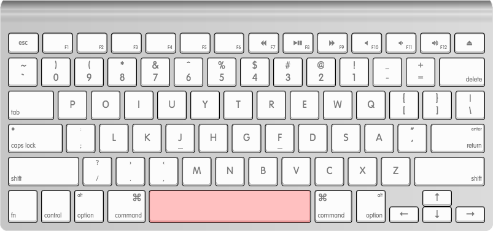

karabiner-half-hand-qwerty
=======================

Includes an implementation of Half Hand Qwerty using Karabiner, formerly keyremap4macbook

See [Karabiner](https://pqrs.org/osx/karabiner/)

# Example

Hold down the Space bar to mirror the keys on the keyboard.

# Installation

See [How to add your own settings](https://pqrs.org/osx/karabiner/document.html.en#privatexml) in the Karabiner documentation.

Use the `private.xml` file as the source of your private settings.

# Thanks to

@tekezo for the excellent Karabiner - [Karabiner](https://github.com/tekezo/Karabiner)

@ijprest for the [keyboard layout editor](https://github.com/ijprest/keyboard-layout-editor/) used to generate the example keyboard images

@alistaircom for the [Apple Wireless Keyboard](https://github.com/ijprest/keyboard-layout-editor/blob/master/samples/apple-wireless.json) layout which served as the basis layout.
